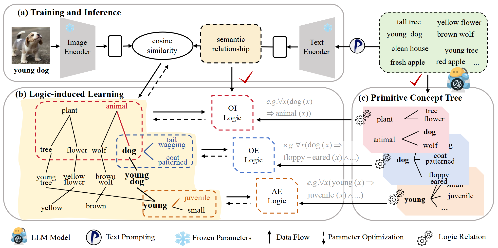
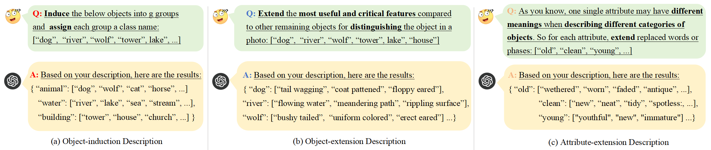

# LOGICZSL: Exploring Logic-induced Representation for Compositional Zero-shot Learning
[[Paper](https://openaccess.thecvf.com/content/CVPR2025/papers/Wu_LOGICZSL_Exploring_Logic-induced_Representation_for_Compositional_Zero-shot_Learning_CVPR_2025_paper.pdf)]

## About LOGICZSL


In this work, we propose LOGICZSL, a novel logic-induced learning framework to explicitly model the semantic relationships. Our logic-induced learning framework formulates
the relational knowledge constructed from large language models as a set of logic rules, and grounds them onto the training data. Our logic-induced losses are complementary to the widely used CZSL losses, therefore can be employed to inject the semantic information into any existing CZSL methods.

## Setup
```bash
git clone https://github.com/Pieux0/LOGICZSL.git
# donwload dataset
cd czsldata
bash ./download_data.sh
# env setup
cd ../models/Troika
conda create --name logic python=3.11.9
conda activate logic
pip install -r requirements.txt
# CLIP pretrained model
cd <CLIP_MODEL_ROOT>
wget https://openaipublic.azureedge.net/clip/models/b8cca3fd41ae0c99ba7e8951adf17d267cdb84cd88be6f7c2e0eca1737a03836/ViT-L-14.pt
```

## Primitive Concept Tree


Use the presented prompt to generate primitive concepts and convert them to json file.

## Training
```bash
python -u train.py \
--clip_arch <CLIP_MODEL_ROOT>/ViT-L-14.pt \
--dataset_path <DATASET_ROOT>/<DATASET> \
--save_path <SAVE_ROOT>/<DATASET> \
--yml_path ./config/<DATASET>.yml \
--num_workers 10 \
--seed 0
```

## Evaluation
```bash
# closed
python -u test.py \
--clip_arch <CLIP_MODEL_ROOT>/ViT-L-14.pt \
--dataset_path <DATASET_ROOT>/<DATASET> \
--save_path <SAVE_ROOT>/<DATASET> \
--yml_path ./config/<DATASET>.yml \
--num_workers 10 \
--seed 0 \
--load_model <SAVE_ROOT>/<DATASET>/<Model_Name>.pt
# open
python -u test.py \
--clip_arch <CLIP_MODEL_ROOT>/ViT-L-14.pt \
--dataset_path <DATASET_ROOT>/<DATASET> \
--save_path <SAVE_ROOT>/<DATASET> \
--yml_path ./config/<DATASET>-ow.yml \
--num_workers 10 \
--seed 0 \
--load_model <SAVE_ROOT>/<DATASET>/<Model_Name>.pt
```

## Citation
```bash
@inproceedings{wu2025logiczsl,
  title={LOGICZSL: Exploring Logic-induced Representation for Compositional Zero-shot Learning},
  author={Wu, Peng and Lu, Xiankai and Hu, Hao and Xian, Yongqin and Shen, Jianbing and Wang, Wenguan},
  booktitle={Proceedings of the Computer Vision and Pattern Recognition Conference},
  pages={30301--30311},
  year={2025}
}
```

## Acknowledgement
We sincerely appreciate the contributions of the open-source community. The related projects are as follows: [CSP](https://github.com/BatsResearch/csp), [Troika](https://github.com/bighuang624/Troika), [LogicHOI](https://github.com/weijianan1/LogicHOI).
